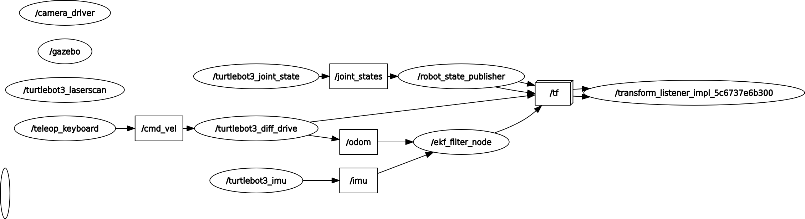

# nav_project
Autonomous navigation stack on ROS2 Humble + Nav2 + SLAM Toolbox, simulated
with TurtleBot3 (Waffle) in Gazebo Classic. Structured as a ROS2 workspace
with two packages: `nav_bringup` (configs, launch, maps) and
`nav_costmap_plugin` (a custom C++ Nav2 costmap layer).

**Status:** SLAM + Nav2 + EKF working. Custom costmap plugin working (hardcoded lethal region). Next: learned cost values.

## Environment
Ubuntu 22.04 · ROS2 Humble · Gazebo Classic 11 · TurtleBot3 Waffle

## Build & setup
```bash
source /opt/ros/humble/setup.bash
colcon build
source install/setup.bash
export TURTLEBOT3_MODEL=waffle
```

## Building a map (SLAM Toolbox)
Each command in its own sourced terminal.
```bash
ros2 launch turtlebot3_gazebo turtlebot3_world.launch.py
ros2 launch slam_toolbox online_async_launch.py use_sim_time:=true
rviz2   # Fixed Frame = map, add /map and /scan
ros2 run turtlebot3_teleop teleop_keyboard   # drive, revisit areas for loop closure
ros2 run nav2_map_server map_saver_cli -f src/nav_bringup/maps/turtlebot3_world
```

## Autonomous navigation (Nav2)
Map path must be absolute — Nav2's map server fails silently on relative paths.
```bash
ros2 launch turtlebot3_navigation2 navigation2.launch.py \
  use_sim_time:=true \
  map:=$HOME/Documents/nav_project/src/nav_bringup/maps/turtlebot3_world.yaml
```
In RViz: **2D Pose Estimate** to set the initial pose (Nav2 errors until this is
set — AMCL can't publish map→odom without it), then **Nav2 Goal** to navigate.

## Sensor fusion — EKF (robot_localization)
Fuses wheel odometry (`/odom`) and IMU (`/imu`) into `/odometry/filtered`.
Config: `src/nav_bringup/config/ekf.yaml`.
- Wheel odom: x/y and forward velocity
- IMU: yaw + angular velocity + linear acceleration (gravity removed)

Validated by comparing `/odom` vs `/odometry/filtered` under teleop — tracks
closely with minor differences (expected: sim odometry has negligible drift).

**Known limitation (sim only):** the Gazebo diff-drive plugin and the EKF both
publish `odom→base_footprint`. The fused estimate is validated numerically but
doesn't own the TF in sim. On hardware the wheel driver cedes the transform to
the EKF.



## Custom costmap plugin (`nav_costmap_plugin`)
A C++ Nav2 costmap layer (`nav_costmap_plugin::SimpleLayer`) that stamps a
**hardcoded** lethal-cost rectangle into the global costmap. Loads via
pluginlib; the global planner routes around the region.

Add to a costmap's plugin list and run:
```yaml
plugins: [..., "simple_layer"]
simple_layer:
  plugin: "nav_costmap_plugin::SimpleLayer"
```
```bash
ros2 launch turtlebot3_navigation2 navigation2.launch.py \
  use_sim_time:=true \
  map:=$HOME/Documents/nav_project/src/nav_bringup/maps/turtlebot3_world.yaml \
  params_file:=$HOME/Documents/nav_project/src/nav_bringup/config/nav2_params_clean.yaml
```

**Stage 1 (done):** hardcoded lethal region, planner routes around it.
**Stage 2 (next):** derive cost from a learned traversability model.

## Scope
Simulation-only (Gazebo). Not validated on physical hardware.